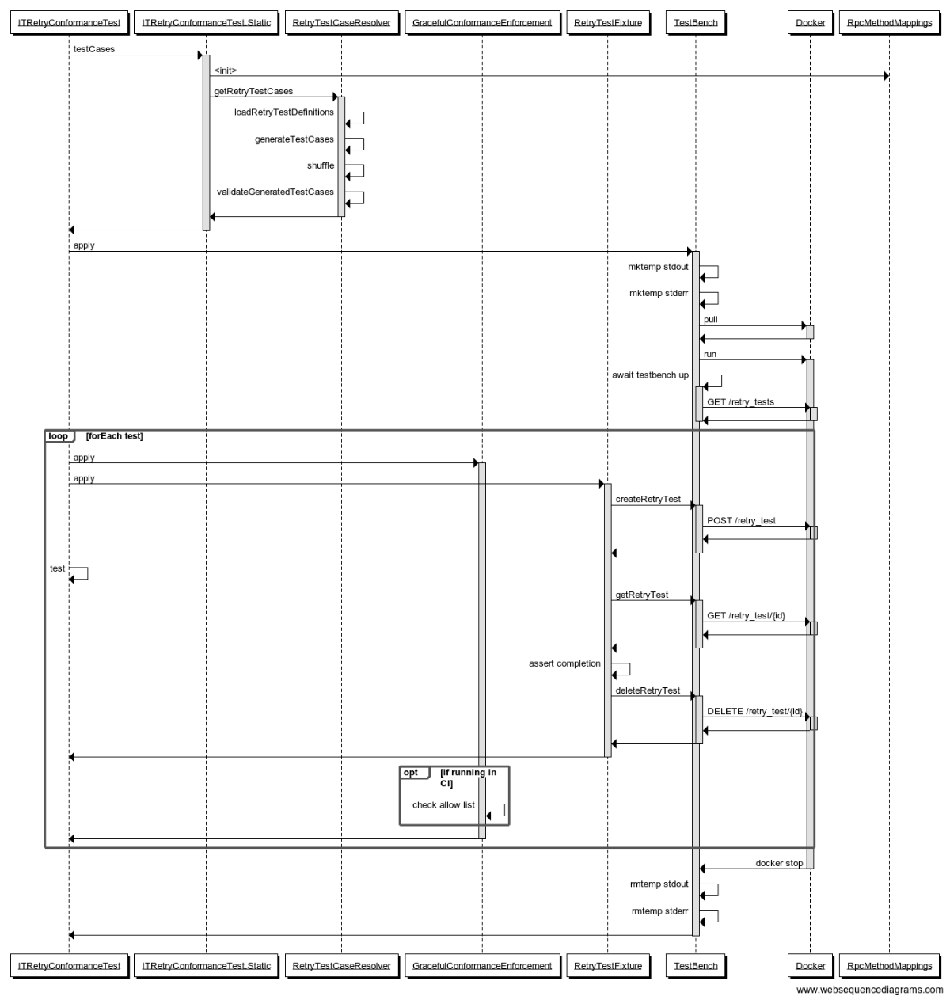

# Conformance Testing

This library leverages the conformance tests defined in [googleapis/conformance-tests](https://github.com/googleapis/conformance-tests)
to ensure adherence to expected behaviors.

Access to the conformance tests is achieved via dependencies on 
[`com.google.cloud:google-cloud-conformance-tests`](https://github.com/googleapis/java-conformance-tests)
which contains all generated protos and associated files necessary for loading
and accessing the tests.

## Running the Conformance Tests

Conformance tests are written and run as part of the JUnit tests suite.

## Suites

### Automatic Retries

The JUnit tests class is [`ITRetryConformanceTest.java`](./src/test/java/com/google/cloud/storage/conformance/retry/ITRetryConformanceTest.java)
and is considered part of the integration test suite.

This tests suite ensures that automatic retries for operations are properly defined
and handled to ensure data integrity.

#### Prerequisites
1. Java 8+
2. Maven
3. Docker (Docker for MacOS has been tested and verified to work as well)

#### Test Suite Overview

The test suite uses the [storage-testbench](https://github.com/googleapis/storage-testbench)
to configure and generate tests cases which use fault injection to ensure conformance.

`ITRetryConformanceTest` encapsulates all the necessary lifecycle points needed
to run the test suite, including:
1. Running the testbench server via docker
2. Setup, validation, cleanup of individual test cases with the testbench
3. CI Graceful enforcement of test failures (enforce no regressions, but allow 
   for some cases to not pass without failing the whole run)

A sequence diagram of how the tests are loaded run, and interact with testbench
can be seen below. Time moves from top to bottom, while component interactions
are shown via arrows laterally.

